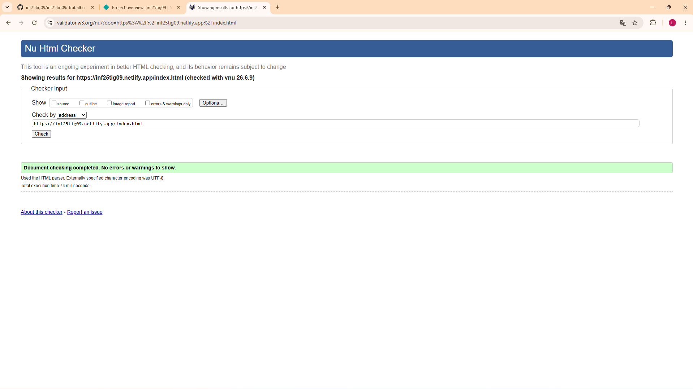
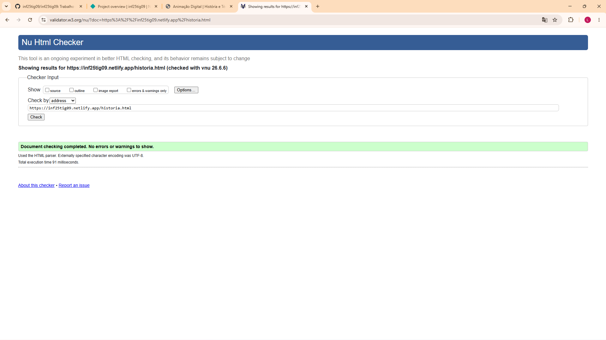
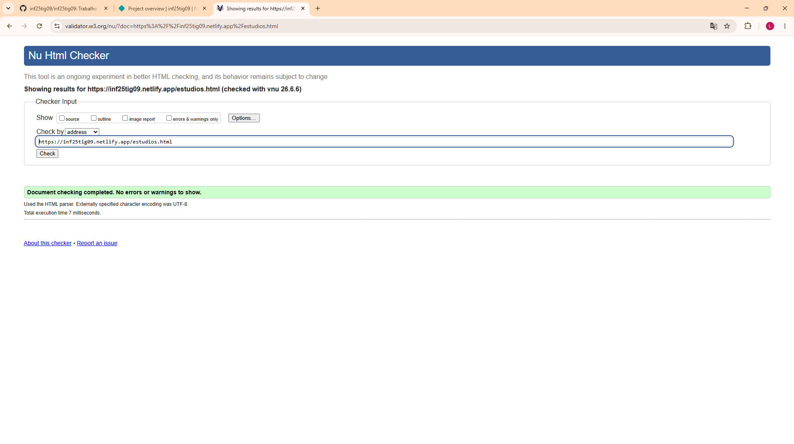
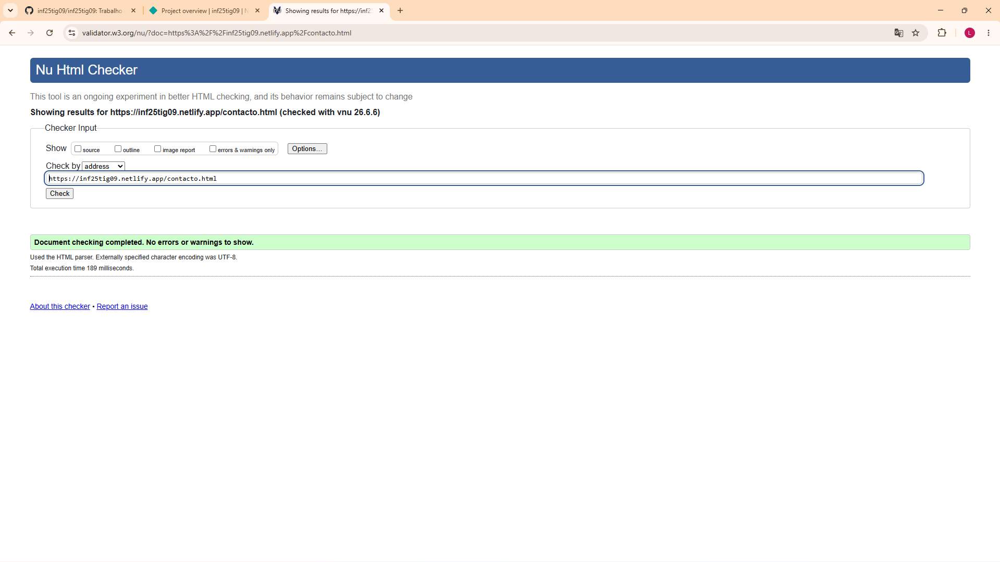
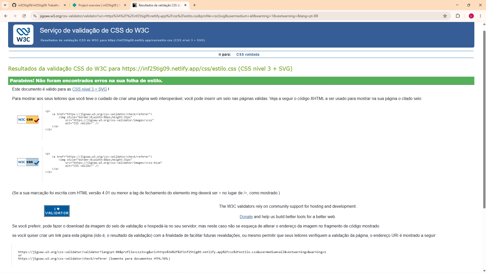

# Relatório do Projeto — Animação Digital: do 2D Tradicional ao 3D

**Unidade Curricular:** Tecnologias da Internet
**Grupo:** inf25tig09
**Alunos:**
- Lucas Gutierrez Encarnação — A048645
- Iury Gabriel Martins Gomes — A050087

**Site publicado:** https://inf25tig09.netlify.app/
**Repositório:** https://github.com/inf25tig09/

---

## 1. Project Presentation — Apresentação do Projeto

Este projeto consiste no desenvolvimento de um sítio Web estático sobre a área da
multimédia, mais concretamente sobre a **evolução da animação digital**, abordando
a passagem da animação tradicional em 2D para as técnicas atuais de animação em 3D.

O site é composto por **quatro páginas estáticas** interligadas, construídas com
HTML5, CSS3 e JavaScript, sem qualquer código do lado do servidor nem bases de dados.
Os únicos conteúdos dinâmicos provêm de um documento **XML**, cuja integração no HTML
é feita por JavaScript executado no cliente.

O objetivo do trabalho é aplicar, de forma prática, os conhecimentos adquiridos ao
longo da disciplina: marcação semântica em HTML5, estilização com CSS3 externo,
estruturação de dados em XML com validação por schema, e manipulação dinâmica de
conteúdos com JavaScript.

### Conteúdos abordados no site

- **Início** — apresentação do tema e do que o visitante vai encontrar;
- **História e Técnicas** — evolução histórica da animação, definições das técnicas
  e uma tabela comparativa com custos de produção;
- **Estúdios e Filmes** — descrição de estúdios conhecidos e uma tabela de filmes
  gerada dinamicamente a partir do documento XML;
- **Contacto** — formulário de contacto e informações do grupo.

---

## 2. User Interface — Interface com o Utilizador

### 2.1 Sitemap

O site tem uma estrutura simples e plana: todas as páginas estão ao mesmo nível e
são acessíveis a partir do menu de navegação presente no topo de cada página.

```
                        ┌─────────────────────┐
                        │      index.html     │
                        │       (Início)      │
                        └──────────┬──────────┘
                                   │
        ┌──────────────────┬───────┴────────┬──────────────────┐
        │                  │                │                  │
┌───────▼───────┐  ┌───────▼───────┐  ┌─────▼─────────┐  ┌─────▼─────────┐
│  index.html   │  │ historia.html │  │ estudios.html │  │ contacto.html │
│   (Início)    │  │  (História e  │  │  (Estúdios e  │  │  (Contacto)   │
│               │  │   Técnicas)   │  │    Filmes)    │  │               │
└───────────────┘  └───────────────┘  └───────┬───────┘  └───────────────┘
                                               │
                                       ┌───────▼────────┐
                                       │  animacao.xml  │
                                       │  (download +   │
                                       │  tabela via JS)│
                                       └────────────────┘
```

### 2.2 Wireframes

Estrutura comum a todas as páginas (cabeçalho, navegação, conteúdo, rodapé):

```
┌──────────────────────────────────────────────────┐
│                     HEADER                         │
│              Animação Digital                      │
│              Do 2D ao 3D                           │
├──────────────────────────────────────────────────┤
│  NAV:  [Início] [História] [Estúdios] [Contacto]   │
├──────────────────────────────────────────────────┤
│                                                    │
│                     MAIN                           │
│   ┌──────────────────────────────────────────┐    │
│   │  h2 - Título da secção                    │    │
│   │  Conteúdo (texto, imagens, tabelas...)    │    │
│   └──────────────────────────────────────────┘    │
│                                                    │
├──────────────────────────────────────────────────┤
│                     FOOTER                         │
│           Grupo inf25tig09 — address               │
└──────────────────────────────────────────────────┘
```

Página inicial (`index.html`):

```
┌──────────────────────────────────────────────────┐
│  HEADER  +  NAV                                    │
├──────────────────────────────────────────────────┤
│  h2 - Bem-vindo                                    │
│         ┌──────────────────────┐                   │
│         │   LOGO (imagem CSS)  │                   │
│         └──────────────────────┘                   │
│  Texto de apresentação                             │
│         ┌──────────────────────┐                   │
│         │   figure + imagem    │                   │
│         │   figcaption         │                   │
│         └──────────────────────┘                   │
│  h3 - O que vais encontrar (lista aninhada)        │
│  ┌────────────────────────────────────────────┐   │
│  │  DICA (caixa destaque)                      │   │
│  └────────────────────────────────────────────┘   │
├──────────────────────────────────────────────────┤
│  FOOTER                                            │
└──────────────────────────────────────────────────┘
```

Página de estúdios (`estudios.html`) — com tabela dinâmica do XML:

```
┌──────────────────────────────────────────────────┐
│  HEADER  +  NAV                                    │
├──────────────────────────────────────────────────┤
│  h2 - Estúdios conhecidos (lista)                  │
│  h2 - Filmes (dados do XML)                        │
│  ┌──────────────────────────────────────────────┐ │
│  │ Título │ Estúdio │ Ano │ Técnica │ <- via JS  │ │
│  ├────────┼─────────┼─────┼─────────┤            │ │
│  │  ...preenchido a partir do animacao.xml...   │ │
│  └──────────────────────────────────────────────┘ │
│  [Descarregar o documento XML]                     │
│  h2 - Curiosidades  [botões JavaScript]            │
│  h2 - Saber mais (links externos)                  │
├──────────────────────────────────────────────────┤
│  FOOTER                                            │
└──────────────────────────────────────────────────┘
```

### 2.3 Resultado final vs estudo inicial

O resultado final manteve-se fiel ao estudo inicial. A estrutura de quatro páginas
com cabeçalho, navegação, conteúdo e rodapé foi respeitada em todas as páginas,
garantindo consistência visual. O menu de navegação é idêntico em todas as páginas,
o que facilita a orientação do utilizador. As principais diferenças face ao esboço
inicial foram pequenos ajustes de espaçamento e a inclusão de uma caixa lateral
(`aside`) na página de história, para aproveitar melhor o espaço horizontal em ecrãs
maiores.

---

## 3. Product — Produto

### 3.1 Descrição do produto

O produto é um sítio Web estático e responsivo composto por quatro páginas HTML5,
uma folha de estilos CSS3 externa, dois ficheiros JavaScript e um par de ficheiros
XML/XSD. Não requer instalação de software adicional para ser visitado — basta um
navegador moderno.

Estrutura de ficheiros:

```
inf25tig09_Site/
├── index.html          (Início)
├── historia.html       (História e Técnicas)
├── estudios.html       (Estúdios e Filmes)
├── contacto.html       (Contacto)
├── css/
│   └── estilo.css      (folha de estilos externa)
├── js/
│   ├── script.js       (manipulação de elementos por eventos)
│   └── xml.js          (leitura do XML e construção da tabela)
├── xml/
│   ├── animacao.xml    (dados dos filmes)
│   └── animacao.xsd    (schema de validação)
└── img/
    ├── logo.png
    ├── comparacao-2d-3d.jpg
    ├── claquete.png
    └── fundo.png
```

### 3.2 Ligação para o site

O site está disponível em: **https://inf25tig09.netlify.app/**

### 3.3 Instruções de instalação e configuração

**Instalação local**

Como o site usa JavaScript para carregar um ficheiro XML, **não funciona corretamente
abrindo os ficheiros diretamente com duplo-clique** (`file://`), porque os navegadores
bloqueiam pedidos a ficheiros locais por segurança. É necessário usar um servidor HTTP
local:

1. Abrir um terminal na pasta `inf25tig09_Site`;
2. Executar: `python3 -m http.server 8000`;
3. Abrir no navegador: `http://localhost:8000/`.

Em alternativa, no VS Code pode usar-se a extensão **Live Server**, que arranca um
servidor local automaticamente.

**Instalação no Netlify (deploy automático via GitHub)**

1. Criar conta gratuita em https://netlify.com (login com a conta GitHub do grupo);
2. Em **Add new site → Import an existing project**, escolher GitHub e selecionar o
   repositório do grupo;
3. Nas definições de build, deixar o comando de build vazio (o site é estático) e
   definir o diretório de publicação como a pasta que contém o `index.html`;
4. Confirmar o deploy. A partir daí, cada `git push` para o repositório atualiza o
   site automaticamente;
5. Em **Site settings → Change site name**, definir o nome `inf25tig09` para obter o
   endereço `https://inf25tig09.netlify.app/`.

**Instalação no Netlify (deploy manual)**

Em alternativa, é possível arrastar a pasta do site diretamente para a área
**Sites** do painel Netlify (drag and drop), sem ligação ao GitHub.

### 3.4 Regras de utilização

O site é de acesso livre e público. **Não existe autenticação** nem qualquer área
reservada. O formulário de contacto é apenas demonstrativo: não envia dados para
nenhum servidor (não é permitido código server-side neste trabalho).

### 3.5 Ajuda à navegação

- O **menu de navegação** está presente no topo de todas as páginas, sempre na mesma
  posição e com as mesmas opções, o que permite ao utilizador saber sempre onde está
  e para onde pode ir;
- Os itens do menu mudam de cor ao passar o rato (efeito `:hover`), dando retorno
  visual ao utilizador;
- As **ligações externas** (para sites de estúdios) têm uma pequena seta adicionada
  por CSS, distinguindo-as das ligações internas.

### 3.6 Validação de formulários

A validação do formulário de contacto é feita do lado do cliente, recorrendo aos
atributos nativos do HTML5:

- O atributo `required` nos campos Nome, Email e Mensagem impede o envio com campos
  vazios;
- O campo de email usa `type="email"`, o que faz o navegador verificar
  automaticamente se o formato introduzido é um email válido.

Esta abordagem não necessita de JavaScript adicional e funciona em todos os
navegadores modernos.

### 3.7 Validação do HTML e CSS

**Método de teste:** os ficheiros foram submetidos aos validadores oficiais da W3C,
usando a opção "Validate by URI" com o site já publicado no Netlify:

- HTML: https://validator.w3.org/
- CSS: https://jigsaw.w3.org/css-validator/

Páginas validadas:

- `https://inf25tig09.netlify.app/`
- `https://inf25tig09.netlify.app/historia.html`
- `https://inf25tig09.netlify.app/estudios.html`
- `https://inf25tig09.netlify.app/contacto.html`

O documento XML foi validado contra o respetivo schema XSD, confirmando-se que
respeita a estrutura definida (elemento raiz `animacao` com vários elementos `filme`,
cada um com `titulo`, `estudio`, `ano` e `tecnica`).

**Resultados:**

Validação HTML (página inicial):



Validação HTML (restantes páginas):





Validação CSS:



> **Nota:** na página de estúdios, a tabela de filmes é construída por JavaScript a
> partir do XML, pelo que o validador analisa o HTML estático (sem as linhas geradas).
> Isto é esperado e não constitui erro.

### 3.8 Detalhes de implementação — Cumprimento dos requisitos mínimos

| Requisito | Onde está implementado |
|-----------|------------------------|
| 4 páginas estáticas | index, historia, estudios, contacto |
| Documento XML + schema | `xml/animacao.xml` + `xml/animacao.xsd` |
| Link para descarregar o XML | `estudios.html` (botão "Descarregar o documento XML") |
| CSS3 externo (nunca inline) | `css/estilo.css` |
| Marcação semântica | `header`, `nav`, `main`, `section`, `article`, `aside`, `figure`, `footer`, `address` |
| Tabela (thead/tbody/tfoot, rowspan, colspan) | `historia.html` |
| Listas (ordenada, não ordenada, definições) + aninhada | `index.html` e `historia.html` |
| Texto com destaque (em, strong, mark) + CSS | todas as páginas |
| Imagens (img + figure/figcaption + imagem por CSS) | `index.html` (figure) e `.icone-filme` no CSS |
| Ligações internas e externas | menu (internas) e `estudios.html` (externas) |
| Formulário | `contacto.html` |
| Seletores simples (tipo, id, classe, pseudo-classe, atributo) | `css/estilo.css` |
| Pseudo-elemento e combinador | `::before`/`::after` e `tbody tr` no CSS |
| Propriedades de texto e fonte | `body`, `header` no CSS |
| Fundo com cor + imagem | `body` no CSS |
| Estilo de lista | `nav ul` no CSS |
| Caixa (margin, border, padding) | `main` no CSS |
| Flutuação, posicionamento e combinados | `nav li` (float), `.etiqueta` (position), `aside` (ambos) |
| Esconder um elemento | classe `.escondido` (display:none) |
| Formatação de tabela | regras `table`, `th`, `td` no CSS |
| Substituição de elemento por imagem | `.logo-texto` no CSS |
| Responsividade (≥2 dimensões) | media queries 768px e 480px |

**Elementos adicionais (valorizados):**

- **JavaScript — manipulação após evento:** na página de estúdios, um botão altera o
  texto e o estilo de um parágrafo; outro botão mostra/esconde uma caixa de
  informação (`js/script.js`);
- **JavaScript — integração XML em HTML:** o ficheiro `js/xml.js` lê o `animacao.xml`
  e constrói dinamicamente as linhas da tabela de filmes, demonstrando a transformação
  de dados XML em HTML no cliente.

---

## 4. Presentation — Apresentação

A apresentação será feita com recurso a um slideshow simples, acompanhando a
demonstração ao vivo do site através do endereço Netlify (servidor HTTP, conforme
exigido). Estrutura prevista para a apresentação (máximo 10 minutos):

1. Apresentação do tema e dos objetivos (1 min);
2. Demonstração das quatro páginas e da navegação (3 min);
3. Demonstração da integração XML → tabela e da manipulação por JavaScript (3 min);
4. Demonstração da responsividade (redimensionar a janela) (1 min);
5. Resultados da validação W3C e conclusão (2 min).

Durante a apresentação, o grupo terá também o ambiente de desenvolvimento aberto
(VS Code) para responder rapidamente a questões sobre o código.

---

## 5. Conclusão

O projeto cumpre todos os requisitos mínimos do enunciado, mantendo um âmbito simples
e bem organizado. Foram aplicados conceitos de HTML5 semântico, CSS3 (incluindo
responsividade), XML com validação por schema e JavaScript para conteúdos dinâmicos.
O trabalho permitiu consolidar competências de estruturação de conteúdos e construção
de interfaces Web do lado do cliente.
